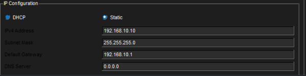
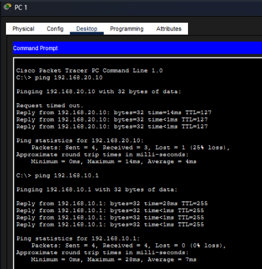

# VLAN Segmentation and Layer 2 Isolation 🛡️

## 📌 Overview
This project demonstrates the implementation of logical network segmentation using **VLAN 10** and **VLAN 20** on a Cisco Catalyst Switch. The setup proves how broadcast domains can be isolated at Layer 2 to enhance security.

> **Status:** Layer 2 Isolation Verified ✅

---

## 📐 Network Topology
The design showcases two end-devices assigned to distinct virtual networks.


---

## ⚙️ Configuration & Implementation

### 1. IP Configuration
Each host was assigned a static IP address within the same subnet, but separated by VLAN tagging.



### 2. Switch Port Assignment
Ports were configured in access mode and assigned to their respective VLAN IDs:

```bash
interface FastEthernet0/1
 switchport mode access
 switchport access vlan 10

interface FastEthernet0/2
 switchport mode access
 switchport access vlan 20
````
 ### 1. Tesst


